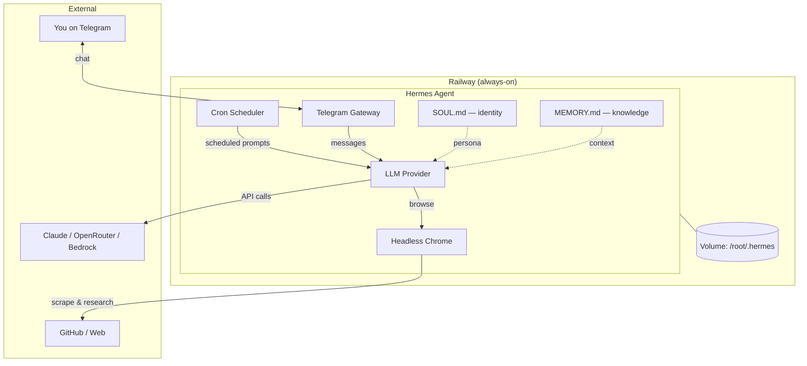

# hermes-mentor

A 24/7 personal AI mentor that runs on [Railway](https://railway.com) and talks to you via Telegram. It doesn't just answer questions — it proactively sends you learning content, project ideas, and challenges on a schedule.

Built on [Hermes Agent](https://hermes-agent.nousresearch.com/) with a headless browser for live web research.

## What it does

- **Morning brief** (8 AM daily) — browses GitHub repos you're tracking, finds interesting issues/PRs, suggests a concept to study
- **Deep dive** (2 PM daily) — one deep technical concept with code references and a mini-experiment to try
- **Weekend challenge** (Friday 8 PM) — a buildable side project spec with real repo links, verified via browser
- **On-demand chat** — message the bot anytime on Telegram for mentorship, code review, architecture discussions

The agent has a headless Chrome browser, so it can actually visit GitHub, read docs, verify links, and find real issues — not just hallucinate them.

## Architecture



## Prerequisites

- [Railway](https://railway.com) account (free tier works for testing)
- [Telegram](https://telegram.org) account
- One of these LLM providers:
  - AWS Bedrock (Claude via AWS)
  - Anthropic API key
  - OpenRouter API key
  - Any OpenAI-compatible endpoint

## Setup

### 1. Create Telegram bot

1. Open Telegram, message [@BotFather](https://t.me/BotFather)
2. Send `/newbot`, pick a name and username
3. Copy the bot token (looks like `7123456789:AAHxyz...`)
4. Message your new bot, then visit `https://api.telegram.org/bot<YOUR_TOKEN>/getUpdates` to find your `chat_id`

### 2. Configure files

```bash
# Copy example files
cp .env.example .env
cp config.yaml.example config.yaml
cp SOUL.md.example SOUL.md
cp MEMORY.md.example MEMORY.md
```

Edit `.env` with your credentials:

```bash
# Pick your LLM provider
ANTHROPIC_API_KEY=sk-ant-...       # Option A: Anthropic directly
# AWS_ACCESS_KEY_ID=...            # Option B: Bedrock
# AWS_SECRET_ACCESS_KEY=...
# AWS_REGION=us-west-2
# OPENROUTER_API_KEY=...           # Option C: OpenRouter

# Telegram
TELEGRAM_BOT_TOKEN=your_bot_token
TELEGRAM_CHAT_ID=your_chat_id
TELEGRAM_ALLOWED_USERS=your_chat_id
```

Edit `config.yaml` — set your model and provider:

```yaml
model:
  default: "anthropic/claude-sonnet-4.6"
  provider: "anthropic"
```

Edit `SOUL.md` — this is the most important file. It defines who the agent thinks you are and how it should mentor you. Be specific about your interests, goals, and what level of explanation you need.

Edit `MEMORY.md` — seed it with your current projects and focus areas.

### 3. Test locally

```bash
docker compose up --build
```

Message your bot on Telegram. If it responds, you're good.

### 4. Deploy to Railway

```bash
# Install Railway CLI
npm install -g @railway/cli

# Login
railway login

# Create project
railway init

# Link to service
railway link

# Add persistent volume
railway volume add --mount-path /root/.hermes

# Set environment variables
railway variable set \
  ANTHROPIC_API_KEY="your-key" \
  TELEGRAM_BOT_TOKEN="your-token" \
  TELEGRAM_CHAT_ID="your-chat-id" \
  TELEGRAM_ALLOWED_USERS="your-chat-id"

# Deploy
railway up -d
```

Your bot should come online within 3-5 minutes (image build + Chrome download).

### 5. Verify

- Message the bot on Telegram — it should respond
- Check logs: `railway service logs`
- Cron jobs will fire at the configured times (see `entrypoint.sh`)

## File structure

```
hermes-mentor/
├── Dockerfile              # Ubuntu + Hermes + boto3 + Chrome
├── entrypoint.sh           # Creates cron jobs on first boot, starts gateway
├── config.yaml.example     # Template: model, provider, personality
├── SOUL.md.example         # Template: agent identity and mentorship style
├── MEMORY.md.example       # Template: persistent context seed
├── .env.example            # Template: credentials
├── docker-compose.yml      # Local testing
├── .gitignore              # Blocks all personal/secret files
│
├── config.yaml             # (gitignored) Your actual config
├── SOUL.md                 # (gitignored) Your actual persona
├── MEMORY.md               # (gitignored) Your actual memory seed
├── .env                    # (gitignored) Your actual credentials
└── refresh-creds.sh        # (gitignored) Your credential rotation script
```

## Customization

### Changing the schedule

Edit `entrypoint.sh` — cron expressions use standard format. Times are in the timezone set in `config.yaml`.

```bash
# Examples:
"0 8 * * *"      # 8 AM daily
"0 14 * * *"     # 2 PM daily
"0 20 * * 5"     # 8 PM every Friday
"every 6h"       # Every 6 hours
```

To pick up schedule changes, delete the volume and redeploy (crons are created on first boot):

```bash
railway volume delete
railway volume add --mount-path /root/.hermes
railway up -d
```

### Changing the persona

Edit `SOUL.md` and redeploy. The entrypoint always copies the latest `SOUL.md` from the image into the volume on startup.

`MEMORY.md` is different — it's only copied on first boot. After that, the agent updates it itself. To reset memory, delete the volume.

### Using a different model

Edit `config.yaml`:

```yaml
# Anthropic direct
model:
  default: "anthropic/claude-sonnet-4.6"
  provider: "anthropic"

# AWS Bedrock
model:
  default: "global.anthropic.claude-opus-4-6-v1"
  provider: "bedrock"
  region: "us-west-2"

# OpenRouter (access to many models)
model:
  default: "anthropic/claude-sonnet-4.6"
  provider: "openrouter"

# Local (Ollama)
model:
  default: "llama3"
  provider: "ollama"
```

### Credential rotation (for SSO/temporary creds)

If your provider uses temporary credentials (e.g., AWS SSO), create a `refresh-creds.sh` script:

```bash
#!/bin/bash
railway variable set \
  AWS_ACCESS_KEY_ID="..." \
  AWS_SECRET_ACCESS_KEY="..." \
  AWS_SESSION_TOKEN="..."
railway service restart
```

Run it daily (or whenever creds expire).

## How persistence works

Railway volume at `/root/.hermes` stores:
- **Sessions** — chat history across conversations
- **MEMORY.md** — agent-managed, grows over time
- **Cron jobs** — survive restarts
- **SOUL.md** — copied from image on every deploy (so edits take effect)

Data survives deploys and restarts. Only deleted if you delete the volume.

## Troubleshooting

| Problem | Fix |
|---------|-----|
| Bot doesn't respond | Check `railway service logs` — likely expired credentials |
| Cron messages not delivered | Verify `TELEGRAM_CHAT_ID` is set correctly in env vars |
| Build fails on Chrome | Ensure you're building for `linux/amd64` (Railway default) |
| "Credentials expired" error | Run your `refresh-creds.sh` or update env vars on Railway |
| Want to reset all state | Delete and recreate the volume |

## Credits

- [Hermes Agent](https://hermes-agent.nousresearch.com/) by Nous Research
- [agent-browser](https://www.npmjs.com/package/agent-browser) for headless Chrome
- [Railway](https://railway.com) for deployment
